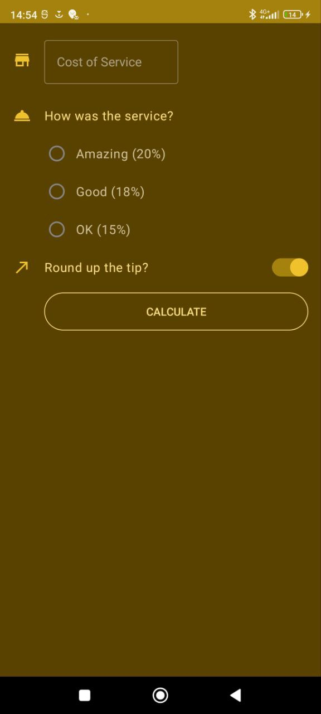

# **Tip Calculator App** :iphone::moneybag:
### On this repository you can find an app that calculates tips based on total bill and service rating :white_check_mark:
  
___
### This app will help you calculate the amount of tips based on your total bill and satisfaction with the service.
### The interface is very simple. To get the result you need:
 - #### Enter the total bill in the field "Cost of Service";
 - #### Select your satisfaction with the service;
 - #### (Optional) Choose mode: to round up the tip or not to;
 - #### Click the button "Calculate".
### After all done actions, on the right under the button you will see the total tip amount.

#### Supported android versions :hammer:: 9.0 and higher
#### Memory size :minidisc:: 13,5 MB

## Application screenshots:

### Dark mode and English :new_moon::

### Light mode and Russian :bulb::

